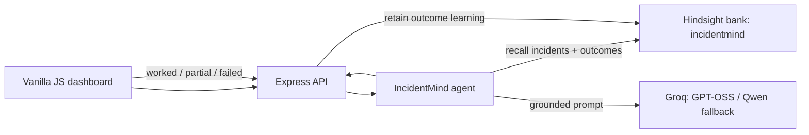

# IncidentMind

Demo video: (link coming soon)

IncidentMind is an on-call incident-response agent that remembers what actually worked before. It compares generic SRE triage against Hindsight-recalled production evidence, then learns from the engineer's outcome. The demo makes the memory advantage visible in one click.

## Tech stack

- Node.js 18+
- Express
- Vanilla JavaScript frontend
- Hindsight memory bank
- Groq LLM

## Project structure

- `public/` — static dashboard UI
- `services/` — Hindsight and Groq integration logic
- `scripts/` — demo helpers and seeding utilities
- `data/` — seeded production incident records
- `server.js` — Express app and API routes

## Architecture



## Setup

1. Use Node.js 18+.
2. Copy `.env.example` to `.env` and set `HINDSIGHT_API_KEY`, `HINDSIGHT_BASE_URL`, and `GROQ_API_KEY`. Keep `.env` private; it is gitignored.
3. Install and seed:

   ```bash
   npm install
   npm run seed
   npm start
   ```

4. Open `http://localhost:3000`. Choose **Load sample alert**, then **Compare Memory OFF vs ON**.

## Running the live demo

```bash
npm install
npm run check
npm run seed
npm start
```

Then open:
- Local URL: `http://localhost:3000`
- Health check: `http://localhost:3000/api/health`
- Sample alert: use the **Load sample alert** button and run **Compare Memory OFF vs ON**.

If you want to share the local app publicly for a demo, use a temporary tunnel such as `ngrok http 3000` or `cloudflared tunnel --url http://localhost:3000` and use the forwarded public URL instead of localhost.

## Reset demo

If you save extra outcomes while testing, re-seed the clean incident memory set before demoing:

```bash
npm run seed
```

This keeps the seeded incident bank idempotent by replacing each document using its incident ID.

## Pre-demo checklist

- `npm run check` passes
- Browser zoom is set to 100%
- Clean browser window with just the app visible
- Notifications disabled
- Recorded demo video saved as backup

## Exact demo script

1. Start with the checkout sample alert: `Checkout latency spike, 504 errors after 14:30 deploy`.
2. Point out that **Without memory** gives broad pool, database, and deployment checks with no historical evidence.
3. Point out that **With Hindsight memory** identifies the post-deploy Hikari/Postgres connection-pool pattern, cites `INC-118`, `INC-101`, and `INC-106`, and warns that pod restarts/scaling had failed in prior incidents.
4. Open **Recalled memories** to show the actual Hindsight evidence behind the recommendation.
5. Click **Worked**, add a note, and choose **Save to memory**. Run the same comparison again: the recalled-memory list now includes an `OUTCOME · WORKED` learning record.

### Terminal demo

The repository includes a portable payload so Windows PowerShell and shells do not have to escape multiline JSON:

```bash
curl -s -X POST http://localhost:3000/api/compare \
  -H "Content-Type: application/json" \
  --data-binary @scripts/demo-alert.json
```

Save an engineer outcome:

```bash
curl -s -X POST http://localhost:3000/api/outcome \
  -H "Content-Type: application/json" \
  --data-binary @scripts/demo-outcome.json
```

## API

- `GET /api/health` — verifies Hindsight and Groq connectivity.
- `POST /api/seed` — idempotently seeds all 18 incidents when enabled for local use.
- `POST /api/analyze?memory=on|off` — analyzes one alert.
- `POST /api/compare` — runs Memory OFF and ON analyses in parallel.
- `POST /api/outcome` — retains a worked, partial, or failed outcome as new learning.

## How Hindsight memory is used

**Seeding:** `data/incidents.json` holds 18 realistic incidents across five services. `npm run seed` turns each one into one natural-language incident narrative with its incident ID, metadata, failed/worked fixes, resolution, and runbook. The incident ID is its Hindsight `documentId`, making reruns safe replacements.

**Recall:** for Memory ON, the agent sends the service, alert, and key logs to the single `incidentmind` Hindsight bank. It selects the most relevant recalled incidents/outcomes, gives them to Groq as evidence, and rejects every incident citation that was not present in recalled metadata.

**Outcome loop:** feedback retains a new, timestamped Hindsight memory containing the alert, recommended fix, result, and engineer notes. The next matching alert can retrieve this `OUTCOME` evidence. Failed outcomes explicitly tell future responders not to repeat the mitigation without fresh evidence.

## Reliability notes

- Both external providers use 20-second request aborts.
- Groq JSON generation retries malformed/failed calls twice, then switches from `openai/gpt-oss-120b` to `qwen/qwen3-32b`; failures return a safe low-confidence object instead of crashing the server.
- Operational logs include timestamp, recall count, model, and latency; no credentials are logged.
