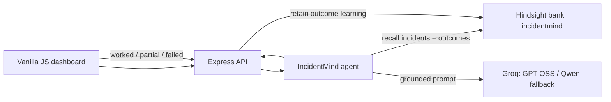

# IncidentMind

> On-call incident response agent that remembers every incident, warns about fixes that already failed, and learns from every outcome. Built with Hindsight memory for HackWith Hyderabad 3.0.

**Demo video:** [Watch the demo](PASTE_VIDEO_LINK_HERE)

On-call engineers lose valuable time re-solving incidents their team has already fixed, because the knowledge is buried in old tickets and chat threads. IncidentMind is an on-call incident-response agent that remembers what actually worked before. It compares generic SRE triage against Hindsight-recalled production evidence, then learns from the engineer's outcome. The demo makes the memory advantage visible in one click.

## Screenshots

| Memory OFF vs ON | Recalled memories |
|---|---|
|  |  |

| Failed-fix warning (search-api) | Outcome saved to memory |
|---|---|
|  |  |

## Key features

- **Memory OFF vs ON comparison:** the same alert analyzed with generic triage and with Hindsight-recalled evidence, side by side.
- **Evidence-grounded answers:** every recommendation cites past incident IDs, and any citation not present in recalled memory is rejected.
- **Failed-fix warnings:** the agent remembers what did not work, so the team is not sent down the same path twice.
- **Outcome learning loop:** engineers mark a fix as worked, partial, or failed, and that result is retained for future alerts.
- **Reliable by design:** request timeouts, retries, a fallback model, and safe error responses.

## Tech stack

- Node.js 18+
- Express
- Vanilla JavaScript frontend
- Hindsight memory bank (Vectorize)
- Groq LLM (`openai/gpt-oss-120b`, fallback `qwen/qwen3-32b`)

## Project structure

- `public/`: static dashboard UI
- `services/`: Hindsight and Groq integration logic
- `scripts/`: demo helpers and seeding utilities
- `data/`: seeded production incident records
- `server.js`: Express app and API routes

## Architecture



## Setup

1. Use Node.js 18+.
2. Copy `.env.example` to `.env` and set `HINDSIGHT_API_KEY`, `HINDSIGHT_BASE_URL`, and `GROQ_API_KEY`. Keep `.env` private; it is gitignored.
3. Install, seed, and start:

   ```bash
   npm install
   npm run seed
   npm start
   ```

4. Open `http://localhost:3000`. Choose **Load sample alert**, then **Compare Memory OFF vs ON**.

## Running the live demo

```bash
npm install
npm run check
npm run seed
npm start
```

Then open:

- Local URL: `http://localhost:3000`
- Health check: `http://localhost:3000/api/health`
- Sample alert: use the **Load sample alert** button and run **Compare Memory OFF vs ON**.

To share the local app publicly for a demo, use a temporary tunnel such as `ngrok http 3000` or `cloudflared tunnel --url http://localhost:3000` and use the forwarded public URL instead of localhost.

### Pre-demo checklist

- `npm run check` passes
- Browser zoom is set to 110-125% for readable recordings
- Clean browser window with just the app visible
- Notifications disabled
- No keys, terminals, or dashboards visible on screen
- Recorded demo video saved as a backup

## Exact demo script

### Scenario 1: checkout latency after a deploy

1. Start with the checkout sample alert: `Checkout latency spike, 504 errors after 14:30 deploy`.
2. Point out that **Without memory** gives broad pool, database, and deployment checks with no historical evidence.
3. Point out that **With Hindsight memory** identifies the post-deploy Hikari/Postgres connection-pool pattern, cites `INC-118`, `INC-101`, and `INC-106`, and warns that pod restarts and scaling had failed in prior incidents.
4. Open **Recalled memories** to show the actual Hindsight evidence behind the recommendation.
5. Click **Worked**, add a note, and choose **Save to memory**. Run the same comparison again: the recalled-memory list now includes an `OUTCOME - WORKED` learning record.

### Scenario 2: repeated OOMKilled pods on search-api

- **Service:** `search-api`
- **Alert:** `search-api pods OOMKilled repeatedly`
- **Logs:** `Exit code 137 OOMKilled` and `heap usage 97% after 6d uptime`

Without memory, the agent gives textbook advice and its first step is to raise the memory limit. With Hindsight memory, it cites `INC-117`, `INC-110`, and `INC-104`, warns that raising the memory limit already failed in `INC-104`, and points to the proven fix: cap the query cache at 25,000 entries, deploy the cache-eviction patch to every deployment template, and add a heap-growth alert. Confidence is medium because no one has yet confirmed this fix as worked, which sets up the outcome loop.

### Terminal demo

The repository includes a portable payload so Windows PowerShell and other shells do not have to escape multiline JSON:

```bash
curl -s -X POST http://localhost:3000/api/compare \
  -H "Content-Type: application/json" \
  --data-binary @scripts/demo-alert.json
```

Save an engineer outcome:

```bash
curl -s -X POST http://localhost:3000/api/outcome \
  -H "Content-Type: application/json" \
  --data-binary @scripts/demo-outcome.json
```

## API

- `GET /api/health`: verifies Hindsight and Groq connectivity.
- `POST /api/seed`: idempotently seeds all 18 incidents when enabled for local use.
- `POST /api/analyze?memory=on|off`: analyzes one alert.
- `POST /api/compare`: runs Memory OFF and ON analyses in parallel.
- `POST /api/outcome`: retains a worked, partial, or failed outcome as new learning.

## How Hindsight memory is used

**Seeding:** `data/incidents.json` holds 18 realistic incidents across five services. `npm run seed` turns each one into one natural-language incident narrative with its incident ID, metadata, failed and worked fixes, resolution, and runbook. The incident ID is its Hindsight `documentId`, making reruns safe replacements.

**Recall:** for Memory ON, the agent sends the service, alert, and key logs to the single `incidentmind` Hindsight bank. It selects the most relevant recalled incidents and outcomes, gives them to Groq as evidence, and rejects every incident citation that was not present in recalled metadata.

**Outcome loop:** feedback retains a new, timestamped Hindsight memory containing the alert, recommended fix, result, and engineer notes. The next matching alert can retrieve this `OUTCOME` evidence. Failed outcomes explicitly tell future responders not to repeat the mitigation without fresh evidence.

## Reset demo

`npm run seed` safely re-seeds the 18 incidents, because each is replaced by its incident ID. Outcomes saved during testing are separate memories and are **not** removed by re-seeding. For a fully clean demo, delete the outcome memories from the Hindsight Cloud UI before recording, or use a fresh bank if your setup supports it.

## Reliability notes

- Both external providers use 20-second request aborts.
- Groq JSON generation retries malformed or failed calls twice, then switches from `openai/gpt-oss-120b` to `qwen/qwen3-32b`. Failures return a safe low-confidence object instead of crashing the server.
- Operational logs include timestamp, recall count, model, and latency. No credentials are logged.

## Hackathon

Built for **HackWith Hyderabad 3.0**, theme: *AI Agents That Learn Using Hindsight*.

- Memory layer: [Hindsight](https://hindsight.vectorize.io/) by Vectorize
- LLM: Groq (`openai/gpt-oss-120b`, fallback `qwen/qwen3-32b`)
- Grand finale: October 3, 2026, Microsoft Hyderabad

## Team

| Name | Role | Links |
|---|---|---|
| [Your Name] | [e.g. Full-stack, memory design] | [GitHub](https://github.com/your-username) / [LinkedIn](https://linkedin.com/in/your-profile) |
| [Teammate 2] | [Role] | [GitHub](https://github.com/username) |
| [Teammate 3] | [Role] | [GitHub](https://github.com/username) |
